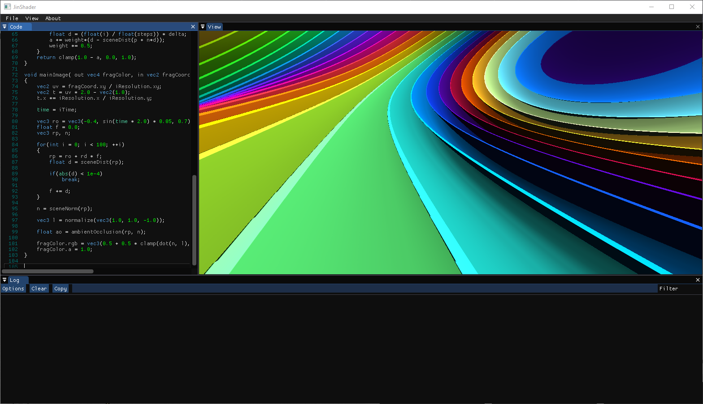
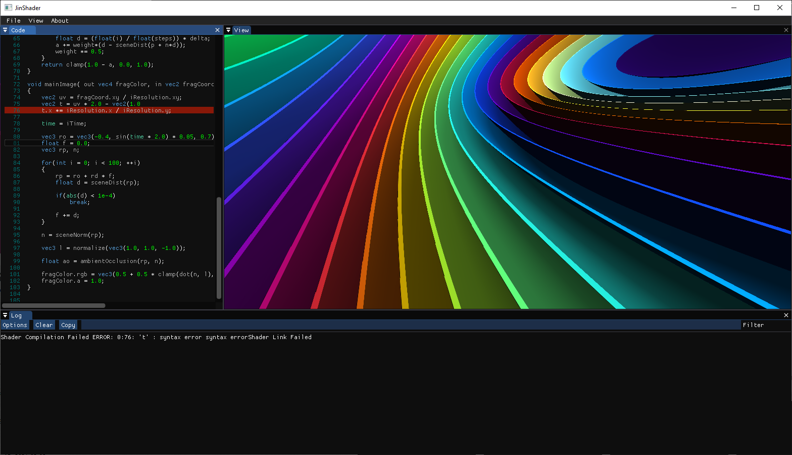

# JinShader
Its an standalone [ShaderToy](https://shadertoy.com) clone

## Features 
- GLSL syntax highlighting
- Results in real-time on every save
- Error console
- Changeable UI 
- In Editor error highlighting 

Shader by [ShaderToy](https://shadertoy.cpm) user [fizzeriz](https://www.shadertoy.com/user/fizzeriz)

Please report any bugs and suggest features and Contribute
